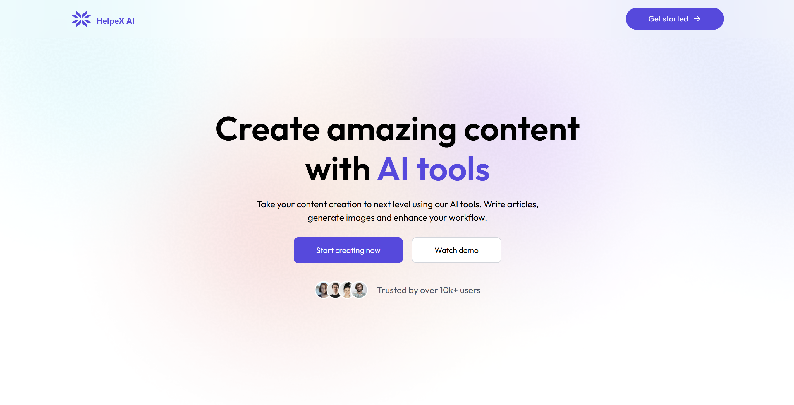
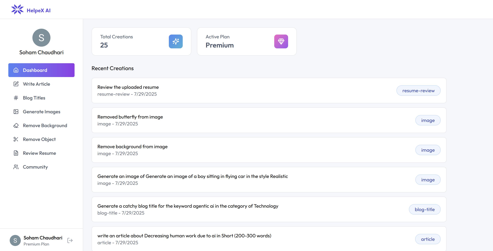
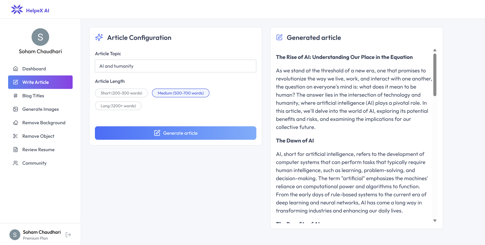
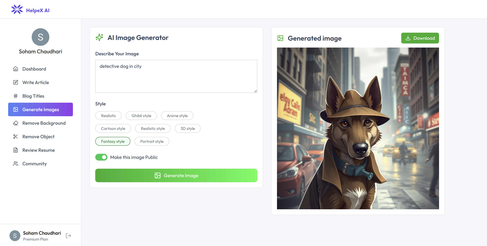

# HelpeX AI 🧠✨

**HelpeX AI** is an advanced AI SaaS (Software-as-a-Service) application that empowers users to create and manage content using cutting-edge AI tools. Whether you're a content creator or a professional looking to fine-tune your resume or images — HelpeX AI has something for everyone.

## 🚀 Live Demo

🔗 [Visit HelpeX AI](https://helpex-ai.vercel.app/)

---

## 🧩 Features

### 🆓 Free Plan:
- ✍️ AI-Powered Article Generation (Llama 3.2-1-b Instruct)
- 📰 Blog Title Generation

### 💎 Premium Plan:
Includes all Free Plan features **plus**:
- 🧠 Advanced Article Generation
- 🧠 Smart Blog Title Suggestions
- 🖼️ AI Image Generation (via ClipDrop)
- 🔍 Resume Review (Llama 3.2-1-b Instruct)
- 🧽 Background Removal (via Cloudinary)
- 🎯 Object Removal from Images (via Cloudinary)
- 🌐 Community Section to view public AI-generated images

---

## 📊 User Dashboard
- View all previously generated:
  - Articles
  - Titles
  - Images
  - Resume reviews
- Manage account settings

---

## 🔐 Authentication & Plans

- User authentication powered by [Clerk.com](https://clerk.com)
- Secure login/signup
- Plan management: Free & Premium

---

## 🛠️ Tech Stack

| Frontend  | Backend | Database | AI/ML Models | Image APIs | Auth |
|-----------|---------|----------|---------------|------------|------|
| React     | Express | PostgreSQL | Llama 3.2-1-b Instruct | ClipDrop, Cloudinary | Clerk |

---

## 📂 Project Structure

```
/client    → React frontend  
/server    → Node.js + Express backend  
/server/db  → PostgreSQL schema and queries  
```

---

## 📸 Screenshots

### Homepage


### Dashboard View


### Article Generation


### AI Image Generator


### Community


---

## 🧪 Models & APIs Used

- **Llama 3.2-1-b Instruct** – for article generation, blog title suggestions, and resume review
- **ClipDrop** – for AI-powered image generation
- **Cloudinary** – for image background removal and object removal
- **Clerk** – user authentication and plan management

---

## 👨‍💻 Installation

1. Clone the repository
   ```bash
   git clone https://github.com/Soham156/HelpeX-AI.git
   cd HelpeX-AI
   ```
2. Install dependencies
   ```bash
   cd client && npm install
   cd ../server && npm install
   ```
3. Set up your `.env` files in both `client/` and `server/` directories with your keys
4. Run the development servers
   ```bash
   # In one terminal
   cd server && npm run dev
   # In another terminal
   cd client && npm run server
   ```

---

## 🌐 GitHub Repository

🔗 [View on GitHub](https://github.com/Soham156/HelpeX-AI)

---

## 📌 License

This project is licensed under the MIT License.

---

## 🙌 Acknowledgements

- Novita AI for Llama model access
- ClipDrop API
- Cloudinary API
- Clerk for authentication

---
